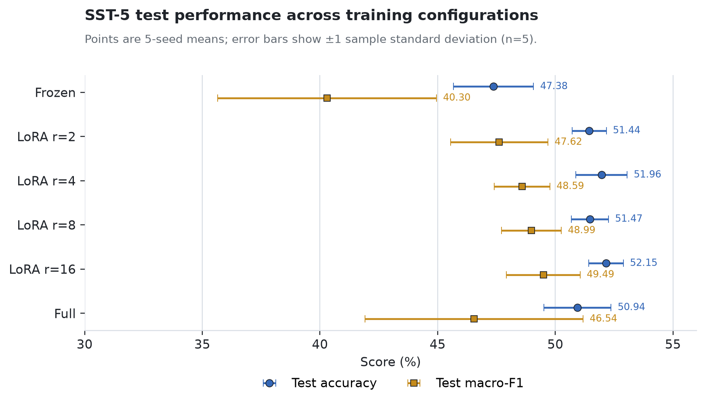

# Adapting GPT-2 with LoRA for SST-5 Sentiment Classification

**Author:** Yifeng Zheng  
**Course:** CS224N Final Project  
**Date:** August 2026

## Summary

This project studies a simple question: can GPT-2 be adapted to a new task by training only a very small number of parameters?

I implemented Low-Rank Adaptation (LoRA) in a GPT-2 Small model and tested it on SST-5, a five-class sentiment classification dataset. I compared three approaches: training only a classification head (`Frozen`), adding LoRA to GPT-2 (`LoRA`), and updating the whole model (`Full`). Six configurations were tested with five random seeds each, for a total of 30 runs.

All four LoRA settings performed better on average than the Frozen baseline. LoRA also achieved results comparable to or better than Full fine-tuning while using far fewer trainable parameters. The best observed test result came from LoRA with rank 16: **52.15% accuracy** and **49.49% macro-F1**. It trained only **0.475%** of the model parameters and produced a **2.30 MiB** task-specific checkpoint, compared with **474.79 MiB** for Full fine-tuning.

The main conclusion is not that rank 16 is always best. Instead, the experiments show that LoRA gives a strong balance between performance and efficiency on this task.

## 1. Motivation

GPT-2 is pretrained as a language model, so it does not directly predict sentiment labels. One way to adapt it is Full fine-tuning, which updates all model parameters. This gives the model a great deal of freedom, but it also requires more memory and a separate full checkpoint for every task.

At the other extreme, we can freeze GPT-2 and train only a small classification head. This is cheap, but the model cannot change its internal text representations.

LoRA provides a middle option. It freezes the original model weights but adds a small trainable update to selected linear layers. The goal of this project was to test whether this limited update is enough for fine-grained sentiment classification.

## 2. Method

For a pretrained weight matrix $W_0$, LoRA writes the adapted weight as

$$
W = W_0 + \Delta W, \qquad \Delta W = \frac{\alpha}{r}BA.
$$

Instead of learning a full update matrix, LoRA learns two smaller matrices, $A$ and $B$. The rank $r$ controls the size of this update. A larger rank gives the model more capacity but also introduces more trainable parameters.

In this project, LoRA was added to the query and value projections in all 12 GPT-2 attention layers. The original GPT-2 weights remained frozen, while the LoRA matrices and the final classification head were trained. Matrix $A$ was randomly initialized and matrix $B$ was initialized to zero, so the LoRA branch did not change the model output at the beginning of training.

The model used the hidden state of the last non-padding token as the sentence representation, followed by a linear layer that predicted one of five sentiment classes.

## 3. Experiment Setup

The experiments used GPT-2 Small and the sentence-level SST-5 dataset:

| Split | Number of examples |
|---|---:|
| Training | 8,544 |
| Validation | 1,101 |
| Test | 2,210 |

The five labels are very negative, negative, neutral, positive, and very positive. Because the classes are not perfectly balanced, I measured both accuracy and macro-F1.

The six configurations were:

- `Frozen`: freeze GPT-2 and train only the classification head.
- `LoRA`: use ranks 2, 4, 8, and 16 on the query and value projections.
- `Full`: update all GPT-2 parameters.

Every configuration was trained for five epochs with seeds 7, 13, 42, 123, and 2026. The batch size was 8, the maximum sequence length was 128 tokens, and training used AdamW with FP16 mixed precision. The best checkpoint was selected by validation accuracy and evaluated once on the test set.

Frozen, LoRA, and Full used different learning rates suited to each method. Therefore, their comparison should be understood as a comparison between practical training setups, rather than a strict experiment where only one variable changed.

## 4. Results

| Configuration | Test accuracy (%) | Test macro-F1 (%) | Trainable parameters | Checkpoint (MiB) |
|---|---:|---:|---:|---:|
| Frozen | 47.38 ± 1.70 | 40.30 ± 4.64 | 3,845 | 0.03 |
| LoRA, $r=2$ | 51.44 ± 0.73 | 47.62 ± 2.07 | 77,573 | 0.33 |
| LoRA, $r=4$ | 51.96 ± 1.09 | 48.59 ± 1.18 | 151,301 | 0.61 |
| LoRA, $r=8$ | 51.47 ± 0.79 | 48.99 ± 1.27 | 298,757 | 1.17 |
| LoRA, $r=16$ | **52.15 ± 0.74** | **49.49 ± 1.57** | 593,669 | 2.30 |
| Full | 50.94 ± 1.43 | 46.54 ± 4.64 | 124,443,653 | 474.79 |

**Figure 1.** Mean test performance across five seeds. Error bars show one sample standard deviation.

The clearest result is the improvement over Frozen. Every LoRA rank increased average test accuracy by about 4.1–4.8 percentage points and macro-F1 by about 7.3–9.2 points. For every matched seed, each LoRA configuration also performed better than Frozen. This suggests that changing a small part of GPT-2's internal attention representation is more effective than training a classification head alone.

LoRA also had a favorable comparison with Full fine-tuning. Rank 16 was 1.21 accuracy points and 2.95 macro-F1 points higher than Full on average. However, this advantage was not equally strong in every seed, so the safe conclusion is that LoRA was competitive with Full, not that it always outperformed it.

The main efficiency difference was much larger. Rank 16 used about **210 times fewer trainable parameters**, produced a checkpoint about **207 times smaller**, and reduced peak allocated CUDA memory by about **51%** compared with Full. The LoRA checkpoint contains only the adapter and classification head, so the shared GPT-2 base model is still required at inference time.

## 5. What the Results Mean

Increasing rank did not steadily improve accuracy. Rank 4 was more accurate than rank 8, while rank 16 had the highest observed test mean. Macro-F1 increased with rank, but the validation difference between ranks 8 and 16 was very small. A larger rank therefore provides more capacity, but does not guarantee better generalization.

Full fine-tuning also showed clear overfitting in this setup. Its best validation checkpoint always appeared in epoch 1 or 2. By epoch 5, its training accuracy was about 50 percentage points higher than its validation accuracy. With only 8,544 training examples, updating all 124 million parameters may give the model more freedom than the task requires. LoRA's low-rank update acts as a useful capacity limit, although this experiment does not prove that it is the only reason for the performance difference.

Rank 16 improved some classes more than others. Compared with Full, its largest gain was on the `very negative` class. This helps explain its stronger macro-F1, but a detailed error analysis would be needed to understand which linguistic patterns remain difficult.

## 6. Conclusion and Limitations

This project shows that LoRA can adapt GPT-2 Small to SST-5 sentiment classification with a very small task-specific parameter budget. All tested LoRA ranks improved over the Frozen baseline, and they achieved competitive average results compared with Full fine-tuning while using much less memory and storage.

Rank 16 gave the highest observed test accuracy and macro-F1, but it should not be treated as a universally optimal rank. The experiment used only one model, one dataset, one LoRA injection pattern, and five seeds. The three training methods also used different learning rates, and the same test split was used to report all rank results. These limits make the findings descriptive rather than universal.

The most useful next steps would be to test the selected rank on another dataset, compare different LoRA injection locations, and perform a small error analysis of neutral sentences, negation, contrast, and sentiment intensity.

Overall, LoRA's main value in this project is simple: **it achieves useful task adaptation without retraining or storing an entire copy of GPT-2.**

## References

[1] Radford, A., et al. (2019). *Language Models are Unsupervised Multitask Learners*.

[2] Hu, E. J., et al. (2022). *LoRA: Low-Rank Adaptation of Large Language Models*. ICLR.

[3] Socher, R., et al. (2013). *Recursive Deep Models for Semantic Compositionality Over a Sentiment Treebank*. EMNLP.
