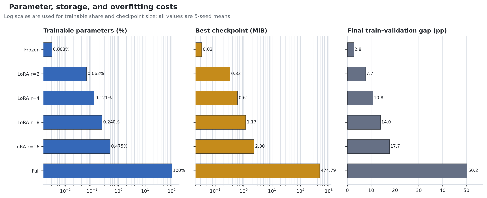

# 基于低秩适配的 GPT-2 情感分类：SST-5 上的性能与参数效率研究

**Parameter-Efficient GPT-2 Sentiment Classification with Low-Rank Adaptation on SST-5**

**作者：** [姓名]  
**单位/课程：** [学院、课程或课题组]  
**日期：** 2026 年 8 月

> **初稿说明：** 本文按中文技术报告结构撰写。实验数字来自已完成的 30 次正式运行，但作者、单位、模板、页数和引用格式仍需按最终提交要求调整。

## 摘要

全量微调 (full fine-tuning) 需要为每个下游任务更新并保存完整的预训练模型参数，这会增加训练显存和多任务存储成本。本研究在 GPT-2 Small 上实现低秩适配 (Low-Rank Adaptation, LoRA)，并在五类 Stanford Sentiment Treebank (SST-5) 情感分类任务上，系统比较冻结编码器 (Frozen)、LoRA (r\in\{2,4,8,16\}) 与全量微调 (Full) 三类适配方案。每个配置使用 5 个随机种子训练 5 轮，共完成 30 次实验，并以测试准确率、宏平均 F1 (macro-F1)、可训练参数、峰值 CUDA 显存、训练时间和 checkpoint 大小进行评估。

实验观察到，LoRA 的四个 rank 配置均在平均测试准确率和 macro-F1 上超过 Frozen 基线。其中，LoRA (r=16) 取得最高的观察测试均值：准确率为 (52.15\%\pm0.74\%)，macro-F1 为 (49.49\%\pm1.57\%)。与 Full 相比，其准确率和 macro-F1 分别高 1.21 和 2.95 个百分点，同时仅训练 593,669 个参数，占模型总参数的 (0.475\%)。其最佳 checkpoint 约为 2.30 MiB，比 Full 小约 206.7 倍，峰值已分配 CUDA 显存降低约 (51.4\%)。然而，准确率并未随 rank 单调增加；若严格按验证集事先选模，验证准确率倾向 (r=2)，验证 macro-F1 则以很小的差距倾向 (r=16)。因此，本研究支持“LoRA 在该任务上提供更优的性能—效率权衡”这一描述性结论，但仍不足以证明 (r=16) 在其他数据集或模型上普遍最优。

**关键词：** GPT-2；低秩适配 (LoRA)；参数高效微调 (parameter-efficient fine-tuning)；情感分类；SST-5

## 1. 引言

预训练语言模型 (pre-trained language model) 通过在大规模文本上学习通用语言表示，可以进一步适配到情感分析、问答和文本生成等下游任务。GPT-2 是基于自回归 Transformer 的预训练语言模型，其零样本迁移结果表明，扩大语言模型和预训练数据可以产生跨任务能力 [1]。对具体任务进行全量微调虽然直接，但需要更新全部预训练参数，并为每个任务保存一份完整模型。当模型规模和任务数量增长时，优化器状态、梯度和任务专用权重都会提高训练与存储成本。

LoRA 由 Hu 等人提出，其核心假设是：预训练模型在下游任务中需要学习的权重更新具有较低的内在秩 (intrinsic rank)。LoRA 冻结原权重，并用两个可训练的低秩矩阵表示权重增量，从而显著减少可训练参数和任务专用存储 [2]。然而，LoRA 在具体任务上的效果取决于模型、注入位置、rank、学习率和数据集，不能仅由参数数量推断。

本研究以 GPT-2 Small 和 SST-5 五类情感分类为对象，围绕以下三个研究问题 (research questions, RQ) 展开：

1. **RQ1：** 与仅训练分类头的 Frozen 基线相比，LoRA 能否稳定提高分类性能？
2. **RQ2：** 与 Full 相比，LoRA 能否用更少的可训练参数、显存和 checkpoint 存储获得有竞争力的测试表现？
3. **RQ3：** LoRA rank 如何影响准确率、macro-F1、参数成本与过拟合？

本文的主要工作包括：（1）在手写 GPT-2 Small 结构中实现 LoRA 线性层，并将其注入 12 个解码器层的 query 与 value 投影；（2）建立 Frozen、四个 LoRA rank 和 Full 的六组对照；（3）使用 5 个随机种子报告均值与样本标准差；（4）同时评估分类性能、参数比例、峰值显存、checkpoint 大小、训练时间和过拟合迹象。

## 2. 背景与方法

### 2.1 GPT-2 Small 情感分类模型

本项目使用 12 层 GPT-2 Small，隐藏维度为 768，每层包含 12 个注意力头。模型以 Hugging Face `gpt2` 预训练权重初始化，通过权重转换程序将合并的 Q/K/V 参数拆分并映射到本项目的 `nn.Linear` 结构。输入文本经 GPT-2 tokenizer 分词，动态填充并截断到 128 tokens；由于 GPT-2 原始 tokenizer 不含专用 padding token，实现中将 EOS token 同时用作 padding token，并在注意力计算中传入 padding mask。

对于长度为 (T_i) 的第 (i) 个句子，模型取最后一个非填充 token 的最终层隐藏状态 (h_i\in\mathbb{R}^{768}) 作为句子表示，再通过线性分类头输出五类 logits：

\[
z_i = W_c h_i + b_c, \qquad W_c\in\mathbb{R}^{5\times768}.
\]

所有训练模式都使用交叉熵损失 (cross-entropy loss)，且分类头始终可训练。分类头共包含 (768\times5+5=3{,}845) 个参数。

### 2.2 LoRA 参数化

设原始线性层权重为 (W_0\in\mathbb{R}^{d_{out}\times d_{in}})。全量微调直接学习与 (W_0) 同形状的权重更新；LoRA 则冻结 (W_0)，并用两个低秩矩阵的乘积表示更新：

\[
W = W_0 + \Delta W, \qquad \Delta W = \frac{\alpha}{r}BA,
\]

其中 (A\in\mathbb{R}^{r\times d_{in}})、(B\in\mathbb{R}^{d_{out}\times r})，且 (r\ll\min(d_{in},d_{out}))。前向传播可写为

\[
y = W_0x + \frac{\alpha}{r}BA\operatorname{Dropout}(x).
\]

实现中，矩阵 (A) 使用 Kaiming 均匀分布初始化，(B) 初始化为全零，因此初始时 LoRA 分支不改变预训练模型的输出。本研究在每个 GPT-2 解码器层中替换 query 投影 (W_q) 和 value 投影 (W_v)，其余 GPT-2 权重保持冻结。所有 rank 均设置 (α=2r)，因此缩放系数 (α/r=2) 在 rank 之间保持不变；LoRA dropout 设为 0.05。

对于 (d_{in}=d_{out}=768) 的 query 或 value 投影，每个 LoRA 分支引入 (r(768+768)) 个参数。考虑 12 层中的 query 和 value 两个投影，再加上 3,845 个分类头参数，LoRA 模式的可训练参数为

\[
N_{trainable}=2\times12\times r\times(768+768)+3{,}845.
\]

该式分别给出 (r=2,4,8,16) 时的 77,573、151,301、298,757 和 593,669 个可训练参数，与运行时统计一致。

### 2.3 对照训练模式

本研究设置以下六个实验配置：

- **Frozen：** 冻结全部 GPT-2 权重，仅训练五类线性分类头。
- **LoRA (r=2,4,8,16)：** 冻结 GPT-2 原权重，训练每层 (W_q) 和 (W_v) 上的 LoRA 矩阵以及分类头。
- **Full：** 训练 GPT-2 全部参数和分类头，作为全量微调对照。

三种模式使用各自预设学习率：Frozen 为 (10^{-3})，LoRA 为 (2\times10^{-4})，Full 为 (2\times10^{-5})。因此，Frozen、LoRA 和 Full 之间的对比应理解为“方法级配置比较”，而不是只改变某一参数的严格单变量消融。LoRA 内部的 rank 比较保持学习率、dropout 和缩放系数一致，因此更接近 rank 消融。

## 3. 实验设置

### 3.1 数据集

实验使用 SST-5 句子级五类情感数据。Stanford Sentiment Treebank 由 Socher 等人基于电影评论句子构建，用于研究否定、组合语义和细粒度情感分类 [3]。本项目通过 `SetFit/sst5` 加载固定的句子级划分 [4]，不使用短语树中间节点作为额外训练样本。数据划分如下：

| 划分 | 样本数 |
|---|---:|
| 训练集 | 8,544 |
| 验证集 | 1,101 |
| 测试集 | 2,210 |

标签 0–4 分别对应 very negative、negative、neutral、positive 和 very positive。根据测试集混淆矩阵的真实类别计数，五类样本数依次为 279、633、389、510 和 399，存在一定类别不平衡。因此，除总体准确率外，本文将各类 F1 等权平均的 macro-F1 作为另一个主要指标。

### 3.2 训练与硬件设置

| 项目 | 设置 |
|---|---|
| 预训练模型 | GPT-2 Small，12 层，(d_{model}=768)，12 头 |
| 任务 | SST-5 五类句子情感分类 |
| 最大序列长度 | 128 tokens |
| Epochs | 5 |
| Batch size | 8，梯度累积步数为 1 |
| 优化器 | AdamW |
| Weight decay | 0.01 |
| 学习率 | Frozen: (10^{-3})；LoRA: (2\times10^{-4})；Full: (2\times10^{-5}) |
| LoRA 设置 | (r\in\{2,4,8,16\})，(α=2r)，dropout = 0.05，注入 (W_q,W_v) |
| 随机种子 | 7、13、42、123、2026 |
| 数值精度 | FP16 自动混合精度 (automatic mixed precision) |
| GPU | 4 张 NVIDIA GeForce RTX 2080 Ti，每张 11 GiB |
| 调度方式 | 两批执行：初始批次最多 4 并发，新增种子批次最多 2 并发；每个实验独占一张卡，无 DDP |
| 运行环境 | Python 3.13.15，PyTorch 2.13.0+cu130，CUDA runtime 13.0 |

每次训练在每个 epoch 后评估验证集。当验证准确率超过当前最佳值时，保存 `best.pt`；训练完成后重新加载该 checkpoint，再对测试集评估一次。这一流程避免使用测试集进行 epoch 级早停，但在事后比较多个 rank 的测试表现时仍需要警惕测试集选择偏差。

### 3.3 评价指标与统计方法

准确率定义为预测正确样本数与样本总数之比。对于类别 (c)，其 F1 为

\[
F1_c=\frac{2TP_c}{2TP_c+FP_c+FN_c},
\]

五类 macro-F1 为

\[
MacroF1=\frac{1}{5}\sum_{c=1}^{5}F1_c.
\]

每个配置的结果报告 5 个随机种子的算术平均与样本标准差，即“均值 ± SD”。由于每组仍只有 (n=5) 个运行，且存在多个 rank 的比较，本文将结果作为描述性证据，不将较小的均值差异表述为统计显著改进。

资源指标包括：（1）`requires_grad=True` 的参数数量与比例；（2）PyTorch 报告的单进程峰值已分配 CUDA 显存；（3）每轮训练时间之和；（4）只保存可训练参数的最佳 checkpoint 大小。过拟合的辅助指标定义为第 5 轮训练准确率减去第 5 轮验证准确率。

### 3.4 实验记录完整性

正式实验清单记录为 `completed`，共30 个完成运行且无失败运行。后处理对运行数、唯一实验名、完整的 (6\times5) 配置—种子网格、`summary.csv` 与每个 `result.json` 的数值一致性、混淆矩阵总数、五轮训练历史、软件/GPU 一致性、训练代码 SHA-256 快照以及聚合均值和样本标准差进行了 10 项检查，全部通过。

## 4. 实验结果

### 4.1 总体分类性能

表1报告六个配置在验证集和测试集上的五种子均值与样本标准差。

**表1　SST-5 分类性能（均值 ± 样本标准差，(n=5)）**

| 配置 | 验证准确率 (%) | 验证 Macro-F1 (%) | 测试准确率 (%) | 测试 Macro-F1 (%) |
|---|---:|---:|---:|---:|
| Frozen | 46.45 ± 1.39 | 40.25 ± 3.80 | 47.38 ± 1.70 | 40.30 ± 4.64 |
| LoRA (r=2) | **50.59 ± 1.08** | 47.32 ± 2.28 | 51.44 ± 0.73 | 47.62 ± 2.07 |
| LoRA (r=4) | 50.34 ± 0.69 | 47.16 ± 2.10 | 51.96 ± 1.09 | 48.59 ± 1.18 |
| LoRA (r=8) | 50.05 ± 0.68 | 47.66 ± 1.99 | 51.47 ± 0.79 | 48.99 ± 1.27 |
| LoRA (r=16) | 50.14 ± 0.94 | **47.72 ± 1.80** | **52.15 ± 0.74** | **49.49 ± 1.57** |
| Full | 49.81 ± 0.96 | 45.46 ± 3.76 | 50.94 ± 1.43 | 46.54 ± 4.64 |

**图1　六种训练配置的 SST-5 测试性能。** 点为 5 个随机种子的均值，误差线为 ±1 个样本标准差。误差线不是置信区间。

对 **RQ1**，所有 LoRA rank 的平均测试准确率都高于 Frozen，提升范围为 4.06–4.78 个百分点；测试 macro-F1 提升范围为 7.32–9.19 个百分点。在按随机种子配对的描述性比较中，四个 LoRA rank 在 5 个种子上的准确率和 macro-F1 都高于同种子 Frozen。这是本研究中最一致的结果：只训练分类头难以充分调整 GPT-2 表示，而对 query/value 投影加入少量可训练低秩更新能够带来稳定改善。

对 **RQ2**，四个 LoRA rank 的平均测试准确率和 macro-F1 也都高于 Full。例如，LoRA (r=16) 相对 Full 的平均准确率和 macro-F1 分别高 1.21 和 2.95 个百分点。但五种子配对结果显示该差异并非每次都同向：(r=16) 的准确率在 4/5 个种子上高于 Full，macro-F1 则只在 2/5 个种子上高于 Full，平均 macro-F1 差异受种子 42 和 2026 的较大正向差值影响。相比之下，LoRA (r=4) 的准确率在 5/5 个配对种子上都高于 Full，macro-F1 在 4/5 个种子上高于 Full，且其 macro-F1 样本标准差为 1.18 个百分点。因此，“LoRA 具有竞争力”得到支持，但“(r=16) 稳定优于 Full”仍不能由这 5 次运行证明。

对 **RQ3**，rank 与准确率之间不存在单调关系：测试准确率从 (r=4) 的 51.96% 下降到 (r=8) 的 51.47%，随后在 (r=16) 升至 52.15%。测试 macro-F1 的均值则随 rank 从 47.62% 逐步增加至 49.49%。验证 macro-F1 也在 (r=16) 达到最高值 47.72%，但仅比 (r=8) 高 0.06 个百分点；验证准确率则在 (r=2) 达到最高值 50.59%。因此，若事先将验证准确率定义为选模指标，应选 (r=2)；若将验证 macro-F1 定义为主指标，则倾向 (r=16)，但这一验证优势很小。

### 4.2 参数、存储与显存成本

**表2　训练资源与存储指标（均值 ± 样本标准差，(n=5)）**

| 配置 | 可训练参数 | 可训练比例 | 峰值 CUDA 显存 (GiB) | 最佳 checkpoint (MiB) | 训练时间 (min) |
|---|---:|---:|---:|---:|---:|
| Frozen | 3,845 | 0.003% | 0.56 ± 0.00 | 0.03 ± 0.00 | 1.99 ± 0.05 |
| LoRA (r=2) | 77,573 | 0.062% | 1.16 ± 0.00 | 0.33 ± 0.00 | 6.25 ± 0.45 |
| LoRA (r=4) | 151,301 | 0.121% | 1.16 ± 0.00 | 0.61 ± 0.00 | 6.09 ± 0.37 |
| LoRA (r=8) | 298,757 | 0.240% | 1.16 ± 0.00 | 1.17 ± 0.00 | 5.95 ± 0.35 |
| LoRA (r=16) | 593,669 | 0.475% | 1.17 ± 0.00 | 2.30 ± 0.00 | 6.08 ± 0.32 |
| Full | 124,443,653 | 100.000% | 2.40 ± 0.00 | 474.79 ± 0.00 | 7.54 ± 0.13 |

**图2　六种配置的参数、checkpoint 和第 5 轮过拟合指标。** 可训练参数比例和 checkpoint 大小使用对数坐标；训练—验证间隔为第 5 轮训练准确率减验证准确率。

LoRA 的可训练参数随 rank 近似线性增加，但即使在 (r=16) 时也仅占模型总参数的 0.475%。相比 Full，(r=16) 训练的参数少约 209.6 倍，最佳 checkpoint 小约 206.7 倍。这一存储优势适用于“多任务共享同一基座模型”的场景：LoRA checkpoint 只包含适配器与分类头，推理时仍需要一份共享的 GPT-2 基座权重，因此 2.30 MiB 不能被解释为独立部署整个模型的总存储。

(r=16) 的峰值已分配 CUDA 显存为约 1.17 GiB，相比 Full 的 2.40 GiB 下降约 51.4%。LoRA 四个 rank 之间的峰值显存差异很小，说明在当前 GPT-2 Small、batch size 和序列长度下，显存的主要部分并不是 LoRA 参数本身，而是基座模型权重与中间激活。与 Full 相比，(r=16) 的平均训练时间缩短约 19.3%。但 30 次实验分两批完成：初始 18 次最多 4 并发，新增 12 次最多 2 并发，且物理 GPU 分配并非完全平衡。因此，本文只将时间结果视为吞吐量参考，不将其解释为精密的单卡速度基准。

### 4.3 过拟合与类别平衡

第 5 轮的训练—验证准确率间隔显示，Full 的平均间隔达 50.18 个百分点，明显高于 Frozen 的 2.80 个百分点和 LoRA 的 7.72–17.72 个百分点。Full 的五次运行均在前两轮取得最高验证准确率：种子 42 和 2026 在第 1 轮选中最佳 checkpoint，种子 7、13 和 123 在第 2 轮选中。此后训练准确率继续上升，但验证准确率未同步改善，说明全量微调在当前学习率和训练轮次下出现了明显过拟合。LoRA 的最终间隔也随 rank 增大，从 (r=2) 的 7.72 个百分点增加至 (r=16) 的 17.72 个百分点，显示更高 rank 虽提供更大的适配能力，也可能提高对训练数据的拟合程度。

为辅助解释 macro-F1 差异，表3对比 Frozen、Full 和观察测试 macro-F1 最高的 LoRA (r=16) 的测试集各类准确率。

**表3　测试集各类准确率（五种子均值，%）**

| 配置 | Very negative | Negative | Neutral | Positive | Very positive |
|---|---:|---:|---:|---:|---:|
| Frozen | 19.6 | 69.4 | 16.0 | 65.4 | 39.3 |
| Full | 29.0 | 62.9 | 28.9 | 68.3 | 46.6 |
| LoRA (r=16) | 39.1 | 62.6 | 28.1 | 67.1 | 49.2 |

与 Full 相比，LoRA (r=16) 对 very negative 的平均类别准确率高 10.1 个百分点，对 very positive 高 2.6 个百分点；在 negative、neutral 和 positive 上分别低 0.3、0.8 和 1.2 个百分点。因此，两者的主要差异集中在极端情感类，尤其是 very negative，而不是每个类别都同时变好。需要注意，逐类准确率只对应各类的召回率，不能单独完整解释同时依赖精确率和召回率的 macro-F1。Neutral 依然是难识别的类别之一，但本实验未包含足以验证其语言学原因的定性错误分析。

## 5. 讨论

### 5.1 LoRA 的主要价值是性能—效率权衡

本研究最稳妥的结论不是某一 rank “必然最优”，而是 LoRA 在当前 GPT-2/SST-5 设置下提供了更有利的性能—效率权衡。与 Frozen 相比，LoRA 只新增少量可训练矩阵即带来了明确的平均性能改善，说明纯线性分类头无法充分消化细粒度情感任务。与 Full 相比，LoRA 的测试均值至少没有因巨幅减少可训练参数而下降，同时具有明显更小的任务专用 checkpoint 和较低的峰值 CUDA 显存。该结果与 LoRA 原论文中“低秩更新可以在减少可训练参数的同时保持任务性能”的出发点一致 [2]，但本文的结果仅针对当前实现和 SST-5 数据集。

Full 在训练集上获得很高的最终准确率，但其验证性能没有持续提高。这表明，对于只含 8,544 个训练句子的当前任务，一次性释放约 1.24 亿个可训练参数带来了过大自由度。LoRA 的低秩约束可以被视为一种结构化的容量控制：它允许模型改变注意力投影，但将更新限制在低维子空间中。不过，本实验没有直接测量权重更新的有效秩或进行更强正则化对照，因此该解释是与观察一致的可能机制，而非被实验证明的因果机制。

### 5.2 rank 更大不等于所有指标更好

随 rank 增加，LoRA 可训练参数线性增长，模型可以表示更高秩的权重更新。测试 macro-F1 的均值确实随 rank 增加，但准确率并非如此，而且 (r=16) 的验证 macro-F1 只比 (r=8) 高 0.06 个百分点。同时，第 5 轮训练—验证间隔随 rank 增大。这表明 rank 引入了典型的容量权衡：过低的 rank 可能限制表达能力，更高的 rank 可能改善某些类别或复杂模式的拟合，但也会增加过拟合风险。

因此，实际选择 rank 时应在看到测试结果前就声明主指标和决策规则。如果任务更重视总体准确率，当前验证数据倾向 (r=2)；如果更重视五个类别的平衡性，当前验证 macro-F1 以很小的差距倾向 (r=16)。(r=16) 是本次报告中的最高观察测试配置，但不应在未经新数据或独立实验验证的情况下被宣称为普遍最优 rank。

## 6. 局限性与有效性威胁

本研究存在以下局限：

1. **随机种子数仍有限。** 每个配置包含 5 次运行，比初始三种子结果更能反映运行间变异，但仍不适合进行强统计推断。
2. **未启用严格确定性。** 虽然设置了 Python、PyTorch 和 CUDA 随机种子，但 `deterministic=false`，同一种子重跑不保证逐位一致。
3. **代码版本追溯仍不完整。** 运行记录中 `git_commit=null`；本地项目中的 7 个训练源文件与服务器记录的 SHA-256 快照全部一致，能证明当前文件内容，但不能恢复 Git 历史。
4. **时间比较存在并发混杂。** 两批实验分别使用最多 4 并发和 2 并发，服务器负载、GPU 个体和调度顺序可能影响训练时间，因此时间结果不是受控单卡基准。
5. **方法间不是严格单变量对比。** Frozen、LoRA 和 Full 使用不同的预设学习率。这使对比更接近各方法的实用配置，但不能把性能差异全部归因于参数化方式。
6. **rank 分析存在多重比较和事后选择风险。** 全部 rank 都在同一测试集上评估，因此不应仅根据最高测试均值选择并宣称最优 rank。
7. **外部有效性有限。** 实验仅使用 GPT-2 Small、SST-5、Q/V LoRA 注入和一组固定训练预算，结论未必能直接推广到更大模型、生成任务、其他数据集或不同 LoRA 注入位置。
8. **资源指标的口径有限。** 峰值 CUDA 指标是 PyTorch 记录的单进程已分配显存，不等于 `nvidia-smi` 展示的整体进程占用；LoRA checkpoint 也不包含共享的基座模型权重。

## 7. 结论与后续工作

本文在 GPT-2 Small 上实现了针对 query 和 value 投影的 LoRA，并通过 30 次 SST-5 实验比较 Frozen、四个 LoRA rank 和 Full。结果显示，LoRA 的四个 rank 在平均测试准确率和 macro-F1 上均超过 Frozen，且在每个配对种子上均保持同向改善；同时，LoRA 以不到 0.5% 的可训练参数获得与 Full 相当或更高的观察测试均值。LoRA (r=16) 在本次实验中取得最高的测试准确率和 macro-F1 均值，同时其可训练参数比 Full 少约 209.6 倍，任务专用 checkpoint 小约 206.7 倍。Full 在第 5 轮呈现出大幅训练—验证间隔，而 LoRA 展现出较弱但随 rank 增大的过拟合迹象。

综合而言，当前数据支持 LoRA 在 GPT-2/SST-5 上提供优于纯 Frozen 分类头、且比 Full 更节省参数和存储的适配方案。但 LoRA 相对 Full 的逐种子差异并非总是同向，rank 的最优性也取决于事先选定的验证指标；现有 5 个随机种子仍不足以确定 (r=16) 具有跨数据集或跨模型的普遍优势。

后续工作将优先考虑：

1. 在全新的保留数据、另一情感分类数据集或事先注册的追加种子批次上验证候选 rank，并在看到测试结果前声明主要验证指标；
2. 启用可行的确定性设置，并在每次运行中强制记录 Git commit、代码哈希、数据快照标识和完整软件环境；
3. 在同一张固定物理 GPU 上串行测量各方法的训练时间与完整显存峰值；
4. 进一步比较 Q-only、V-only、Q/V 和更多投影位置，并为 Full 与 LoRA 独立调整学习率和早停规则；
5. 对 Neutral 和极性类别开展定性错误分析，检查否定、转折结构、反讽和情感强度边界。

## 参考文献

[1] Radford, A., Wu, J., Child, R., Luan, D., Amodei, D., & Sutskever, I. (2019). *Language Models are Unsupervised Multitask Learners*. OpenAI Technical Report. https://cdn.openai.com/better-language-models/language-models.pdf

[2] Hu, E. J., Shen, Y., Wallis, P., Allen-Zhu, Z., Li, Y., Wang, S., Wang, L., & Chen, W. (2022). *LoRA: Low-Rank Adaptation of Large Language Models*. International Conference on Learning Representations (ICLR). https://openreview.net/forum?id=nZeVKeeFYf9

[3] Socher, R., Perelygin, A., Wu, J., Chuang, J., Manning, C. D., Ng, A., & Potts, C. (2013). Recursive Deep Models for Semantic Compositionality Over a Sentiment Treebank. *Proceedings of EMNLP 2013*, 1631–1642. https://aclanthology.org/D13-1170/

[4] SetFit. *Stanford Sentiment Treebank—Fine-Grained (`SetFit/sst5`)*. Hugging Face Datasets. https://huggingface.co/datasets/SetFit/sst5

## 附录 A：可复核材料

本报告的主要实验证据由以下文件支持：

- `runs/main-study/manifest.json`：实验清单、参数与完成状态；
- `runs/main-study/summary.csv`：30 次单独运行的结果；
- `runs/main-study/aggregate.csv`：各配置的原始聚合结果；
- `analysis/report-data/validated_runs.csv`：交叉校验后的单次运行数据；
- `analysis/report-data/validated_aggregate.csv`：独立重算的均值和样本标准差；
- `analysis/report-data/quality_checks.csv`：完整性和一致性检查；
- `analysis/analyze_results.py`：结果验证与聚合脚本；
- `analysis/make_paper_figures.py`：本文图1和图2的可复现绘图脚本。
